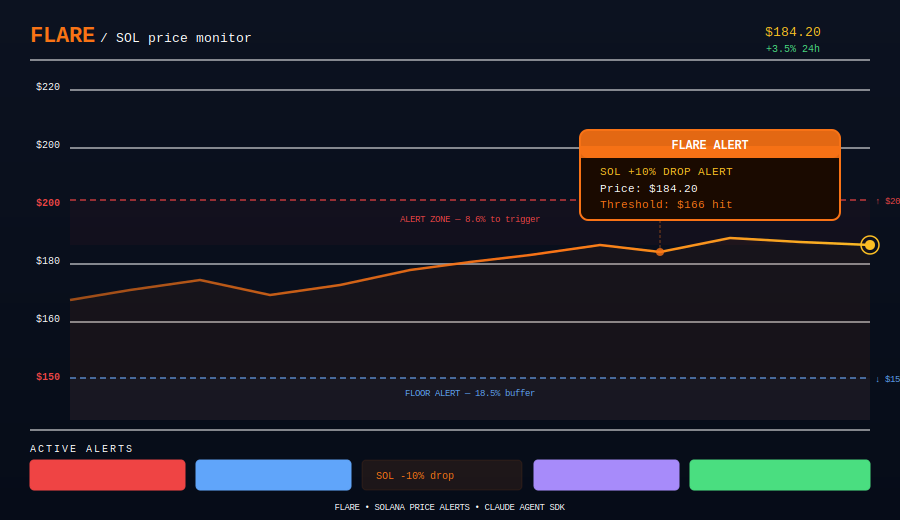
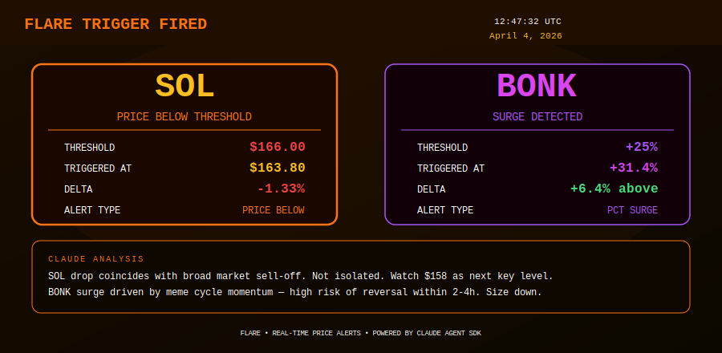

<div align="center">

# Flare

**Real-time price alert agent for Solana tokens.**
Set levels once. Get notified when they hit — with Claude's read on what it means and what to do about it.

[](https://github.com/FlarePriceAlert/Flare/actions)

[](https://docs.anthropic.com/en/docs/agents-and-tools/claude-agent-sdk)

</div>

---

Price alerts are everywhere. The problem is they fire and leave you staring at a number with no context. `Flare` checks every 10 seconds, and when an alert triggers, it calls Claude to explain what happened — is this a liquidation cascade, a breakout, a whale move, or just noise? You get the signal and the story at the same time.

```
WATCH → DETECT → TRIGGER → ANALYZE → ALERT
```

---

## Price Monitor with Alert Zones



---

## Triggered Alert View



---

## Alert Types

| Condition | Trigger |
|-----------|---------|
| `price_above` | Price crosses level upward |
| `price_below` | Price drops below level |
| `pct_change_up` | 24h change exceeds % threshold |
| `pct_change_down` | 24h drop exceeds % threshold |
| `volatility_spike` | 1h absolute change exceeds % |

---

## Quick Start

```bash
git clone https://github.com/FlarePriceAlert/Flare
cd Flare && bun install
cp .env.example .env
bun run dev
```

---

## License

MIT

---

*know when it matters, understand why.*
